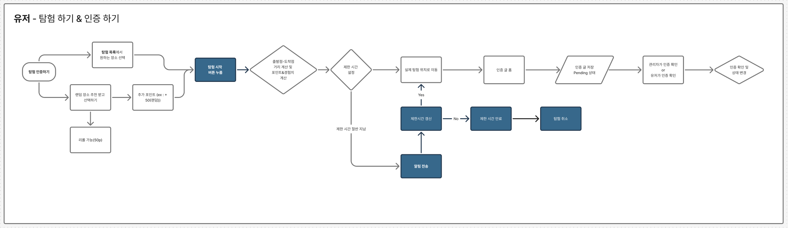
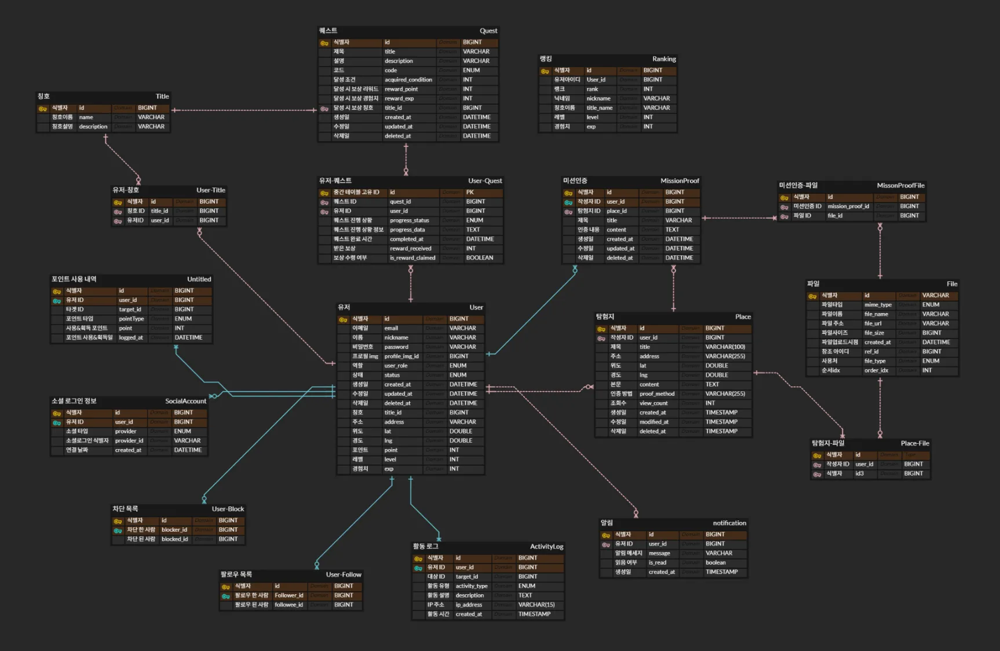
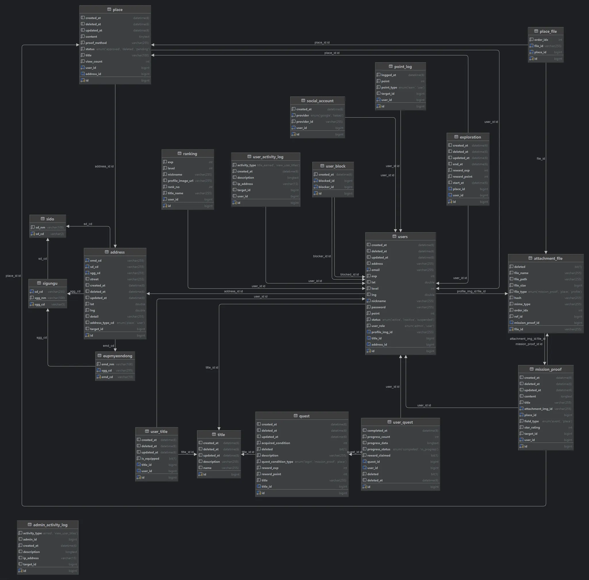
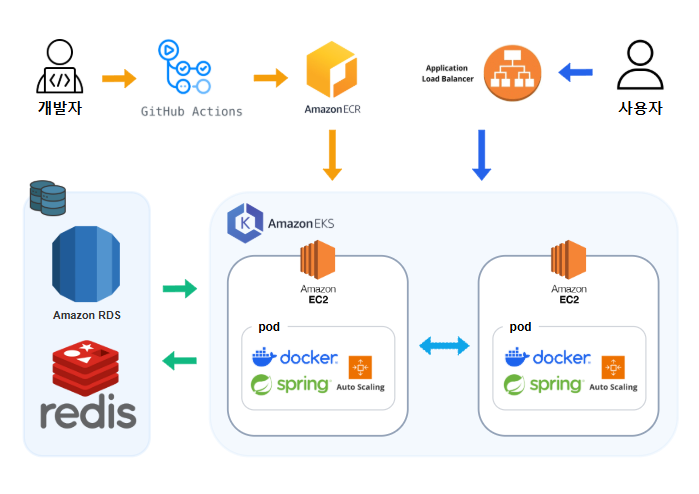
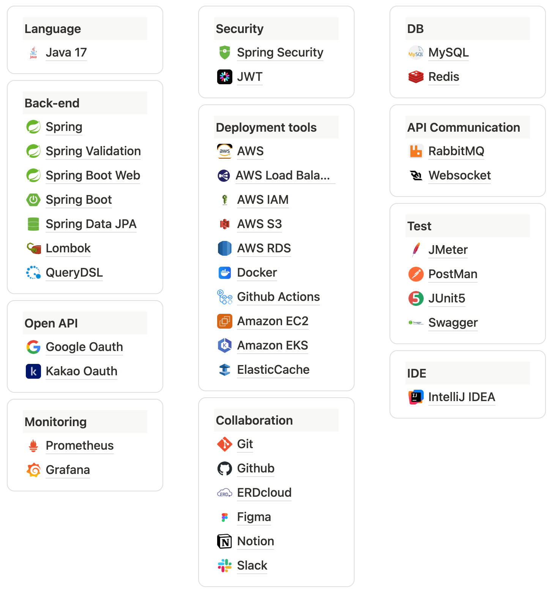

# 일상을 탐험하는 공간 기록 플랫폼: Gabom?
- - - -
‘가봄?’은 거창한 여행이 아닌, 일상 속 작은 발견을 기록하고 나누는 위치 기반 플랫폼입니다.


## 목차
-  - - - 
<h2>📋 목차</h2>

- [🤠 왜 '가봄?'을 만들었나요?](#-왜-'가봄?을-만들었나요?)
- [🔍 가봄에는 이런 기능이 있어요](#-가봄에는-이런-기능이-있어요)
- [📐 프로젝트 설계](#-프로젝트-설계)
- [⚙️ 우리가 사용한 기술들](#-우리가-사용한-기술들)
- [🤔 우리가 고민한 기술 선택들](#-우리가-고민한-기술-선택들)
- [📈 우리가 진행한 성능 개선 방법](#-우리가-진행한-성능-개선-방법)
- [🎤 우리가 해결한 문제와 접근 방식](#-우리가-해결한-문제와-접근-방식)
- [‍👥 팀원 소개](#-팀원-소개)


## 🤠 왜 '가봄?'을 만들었나요?

----
**여러분들은 나들이를 가고 싶을 때 주변 정보를 어떻게 찾으시나요?**

많은 사람들이 네이버 지도, 카카오 지도 같은 지도 앱에서 장소를 찾곤 합니다.

하지만 거기에 소개된 장소들은 이미 너무 유명해져서 긴 줄을 서야 하기도 하고,
추천 순위나 인기 장소가 실제 사용자들의 선택이라기보다 광고비나 리뷰 조작으로 왜곡된 정보일 때도 많습니다.

리뷰 역시 방문하지 않은 사람도 자유롭게 작성할 수 있어 신뢰하기 어려운 경우도 많죠.

덜 알려진 장소를 찾기 위해 인스타그램이나 블로그를 살펴보는 방법도 있지만, 이런 플랫폼은 정보가 너무 방대해서 정작 장소에 대한 핵심 정보만 얻기는 쉽지 않습니다.

그래서 우리는 생각했습니다.

**내가 경험한 숨은 명소를 믿을 수 있는 방식으로 공유할 수는 없을까?**

“가봄?”은 그렇게 만들어졌습니다.

> **‘가봄?’은 거창한 여행이 아닌, 일상 속 작은 발견을 기록하고 나누는 위치 기반 플랫폼입니다.**
>
>
> 동네의 숨은 맛집, 아는 사람만 아는 포토 스팟, 생활을 편리하게 해주는 지름길까지 우리의 일상 가까이에는 아직 알려지지 않은 공간들이 숨어 있습니다.
>
> ‘가봄?’은 이런 순간들을 탐험처럼 즐기고, 기록으로 남길 수 있게 합니다.
>
> 그리고 이 기록은
> **동네 사람들에게는 새로운 시선이 되고, 멀리서 찾아온 여행자들에게는 진짜 로컬을 만날 수 있는 길잡이**가 됩니다.
>
### 🗡️ 1. 탐험의 시작 : 일상 속 작은 발견

사용자는 회원가입 후 기본 주소를 등록하고, 주변의 잘 알려지지 않은 장소를 추천 받을 수 있습니다.
골목길 카페, 동네 소품샵, 지름길처럼 익숙한 공간이 새로운 탐험지가 됩니다.

---

### 📜 2. 탐험의 기록 : 경험이 되다

장소를 방문하면 **GPS 인증과 인증글 작성**으로 경험을 남길 수 있습니다.
기록에 따라 **포인트와 경험치**를 얻고, **레벨과 랭킹, 활동 로그**들로 자신의 활동을 확인할 수 있죠.

퀘스트와 업적 시스템은 **다음 탐험의 동기**가 되어,
**탐험 → 인증 → 보상**의 흐름이 자연스럽게 이어집니다.

---

### 🏰 3. 탐험의 확장 : 함께 완성하는 지도

‘가봄?’에서는 누구나 직접 장소를 등록할 수 있으며,
해당 장소를 방문해 인증글을 남길 수 있습니다.

사진, 후기, 별점 등이 하나씩 쌓이면서, **하나의 공간이 다양한 시선으로 기록됩니다.**
이렇게 모인 기록들은 단순한 위치 정보에 그치지 않고,
**사용자 참여로 완성되는 탐험 지도**로 확장됩니다.

또한 이 기록들은 다른 사용자에게는 **다음 탐험의 단서**가 되고,
**동네 주민에게는 익숙한 공간을 새롭게 바라보는 계기**,
**여행자에게는 관광지 너머의 진짜 로컬을 만나는 출발점**이 됩니다.

## 🔍 가봄에는 이런 기능이 있어요

----
### 💡유저 플로우

### 사용자 이용 흐름
🙆 **탐험 성공** 
- 장소 선택 → 탐험 시작 → 탐험 시간 연장 → 도착 → 보상 흐름

🙅 **탐험 실패**
- 장소 선택 → 탐험 시작 → 탐험 시간 만료 알림

💰**포인트 지급**
- 사진 업로드 / 후기 입력 → (승인 대기중인 인증 글 → 5명 이상 되면 등록 및 리워드 포인트 지급)


## 📐 프로젝트 설계

----
### ERD
- v1

- v2

### API 명세서
[API Documentation](https://www.notion.so/teamsparta/2372dc3ef514817b8c26c6c58d9dca74?v=2372dc3ef5148125af94000c7b0d96b6&source=copy_link)
### 시스템 아키텍쳐


## ⚙️ 우리가 사용한 기술들

----


## 🤔 우리가 고민한 기술 선택들

-----
### 인증 방식 선택 - JWT 사용
  - ### 🧠 선택한 이유 및 판단 기준

    - **서비스 간 인증 정보 전달**이 필요해지는 MSA 구조에서는 **서버 세션 의존도가 낮은 인증 방식**이 유리
    - JWT는 자체적으로 사용자 정보를 담고 있어 **토큰만으로 인증 상태를 확인할 수 있음**
    - **API Gateway 또는 각 서비스가 토큰을 검증할 수 있기 때문에 서비스 간 결합도가 낮아짐**

### 실시간 알림 - WebSocket 사용
- ### 🧠 선택한 이유 및 판단 기준
  - 실시간성 
  - 양방향 통신 기본 
  - 사용자별 1:1 라우팅 쉬움 
  - 점진적 황장 용이 
  - 개발 생산성과 표준성

### 퀘스트 보상 수령 시 랭킹 저장 - RabbitMQ 사용
- ### 🧠 선택한 이유 및 판단 기준
  - 실시간성 & 사용자 경험
  - 이벤트 빈도
  - 운영 복잡도
  - 확장성

### 랭킹 시스템 조회 성능 개선 - Redis 사용
- ### 🧠 선택한 이유 및 판단 기준
  - 조회 성능 개선
  - DB 부하 감소
  - 확장성

### 파일 저장 구조 개선 – Hash 기반 경로 설계
- ### 🧠 선택한 이유 및 판단 기준

  - 중복 업로드 방지
  - 파일 경로 일관성 확보
  - 보안성 향상
  - 저장소 최적화

### API 문서화 도구 선택 - Swagger 사용
- ### 🧠 선택한 이유 및 판단 기준

  - 문서와 실제 API 동기화
  - 팀 간 협업 효율 증대
  - MSA 확장성 확보
  - API 변경 관리 용이

## 📈 우리가 진행한 성능 개선 방법

----
- ### 장소 검색 성능 개선

| 문제 | 해결 방법 | 개선 결과 |
| --- | --- | --- |
| 1. 한 쿼리 과도한 조회 | ID → DTO조회 2단계 분리 | 20초 → 5~10초 |
| 2. 지역 코드 인덱스 미적용 | 인덱스 추가 | 인기순 5.7초 |
| 3. 불필요한 조인 | 조건 분기 처리 | 최신순 32ms |
| 4. 거리 계산 과부하 | Bounding Box 필터 → 거리 계산 | 거리순 390ms |
| 5. MySQL 한계 | **ElasticSearch 도입 + Nori 분석기** | 키워드 검색 400ms |

- ### 데이터 bulk 성능 개선

| 문제                                  | 해결 방법                                                                | 개선 결과                                                |
| ----------------------------------- | -------------------------------------------------------------------- | ---------------------------------------------------- |
| 1. CSV 행마다 `emdCd` 존재 여부 쿼리 발생      | 시작 시 `emdCd` 전부 로딩 → \*\*메모리 Set.contains()\*\*로 검증                  | 행당 SELECT 제거 → DB 부하 감소, 전체 속도 100~~110초 → 약 40~~60초 |
| 2. Place 저장 시 INSERT 후 UPDATE 2회 발생 | `INSERT ... ON DUPLICATE KEY UPDATE` (UPSERT) + 해시 비교로 불필요 UPDATE 제거 | 불필요 쓰기 제거 → 수십 % 추가 단축                               |
| 3. JPA 단건 저장 루프                     | `JdbcTemplate.batchUpdate` / 멀티행 INSERT / batch size 조정              | 수만 건 처리도 수 초 단축                                      |
| 4. 콘솔 출력 및 불필요 로그 다수                | 로그 샘플링(예: 5,000행마다 1회) + 종료 후 집계 출력                                  | I/O 병목 제거, 안정적 병렬화 가능                                |
| 5. CSV 파싱/적재 전체 직렬 for-loop         | 파티션 분리 후 병렬 처리 (스레드풀/Chunk 기반)                                       | 대량 데이터 시 선형 단축, CPU 코어수만큼 확장                         |
| 6. MySQL 적재 한계                      | **LOAD DATA INFILE** / **ElasticSearch 연계** (Nori 분석기 등)             | 수십만 건 단위도 수 초\~수십 초 내 적재                             |

## 🎤 우리가 해결한 문제와 접근 방식

----
<details> 
  <summary>잘못된 JWT 토큰 처리 누락 이슈</summary>
  <div>

### 🔍 문제 요약

- **현상**: Authorization 헤더에 **이상한 토큰**이 들어와도 예외가 발생하지 않고 `null`로 간주되어 인증이 필요 없는 요청처럼 처리됨
- **예상 동작**: 잘못된 토큰 → 예외 발생 → `401 Unauthorized` 응답 반환
- **실제 동작**: 잘못된 토큰 → `null` 반환 → 인증 없이 접근 가능 → 일부 보안 영역에서 `403 Forbidden` 발생

---

### 🧪 원인 분석

기존의 토큰 파싱 로직:

```java
private String getJwtFromRequest(HttpServletRequest request) {
    String bearerToken = request.getHeader("Authorization");
    if (StringUtils.hasText(bearerToken) && bearerToken.startsWith("Bearer ")) {
        return bearerToken.substring(7); // Bearer 접두사 제거
    }
    return null; // 토큰 없거나 형식이 맞지 않으면 null 반환
}
```

- `Authorization` 헤더가 **존재하지 않으면** null → OK (비로그인 접근 허용 구간)
- 하지만 `Authorization` 헤더가 **존재하면서도 토큰 형식이 이상한 경우**에도 단순 null 처리 → ❌ 문제 발생
    - 이 경우는 "로그인은 했지만 토큰이 유효하지 않은" 상태이므로 **예외 처리**가 필요함

---

### ✅ 해결 방법

```java
private String getJwtFromRequest(HttpServletRequest request) {
    String bearerToken = request.getHeader("Authorization");

    // 1. Authorization 헤더가 아예 없는 경우 → 비로그인 요청으로 처리
    if (!StringUtils.hasText(bearerToken)) {
        return null;
    }

    // 2. Authorization 헤더가 있지만 형식이 잘못된 경우 → 예외 발생
    if (!bearerToken.startsWith("Bearer ")) {
        throw new CustomException(ErrorCode.INVALID_TOKEN);
    }

    return bearerToken.substring(7);
}
```

- **케이스 분리**:
    - 헤더가 없는 경우: `null` 반환 → 비로그인 접근 허용
    - 헤더는 있지만 형식이 잘못된 경우: `CustomException` 발생 → `401 Unauthorized` 응답
- 이를 통해 **의도치 않은 인증 우회 문제를 예방**

---

### 🔐 효과

- 인증이 필요한 요청에 대해 **이상한 토큰을 들고 접근하는 경우 명확히 차단**
- 클라이언트 측에서도 응답 코드를 보고 **정확하게 인증 상태 판단 가능**
- 토큰 처리 흐름의 **명확성 및 보안성 향상**
  </div>
</details>

<details>
  <summary>없는 페이지 요청 시 404가 아닌 401 에러가 발생</summary>
  <div>

### 🧩 문제 상황

`없는 페이지로 GET 요청`을 보냈는데, 기대한 404가 아니라 **401 Unauthorized**가 발생함.

### 📌 로그상 흐름

```
✅ 인증 완료 - userId: 1
⚠️ Resolved [HttpRequestMethodNotSupportedException: Request method 'GET' is not supported]
```

- 인증은 정상적으로 완료됨
- 하지만 클라이언트가 존재하지 않는 URL로 **잘못된 HTTP 메서드(GET)** 요청을 보냄
- 따라서 `HttpRequestMethodNotSupportedException` 발생

그런데 이 예외가 왜 `401 Unauthorized`로 응답되었을까?

---

### 🔎 문제 원인 분석

**🔸 1. DispatcherServlet까지 도달**

- 요청은 인증을 통과했고, `DispatcherServlet → HandlerMapping`까지 도달
- 하지만 매핑되는 핸들러가 없어 `HttpRequestMethodNotSupportedException` 발생

**🔸 2. `DefaultHandlerExceptionResolver`가 로그만 남기고 처리 안 함**

- `DispatcherServlet`은 내부적으로 `DefaultHandlerExceptionResolver`를 통해 해당 예외를 처리
- 하지만 View 기반 응답만 처리 가능하며, REST API와 같은 JSON 응답은 직접 처리하지 않음.

    ```java
    return new ModelAndView(); // 비어 있는 View 반환 → 아무것도 렌더링하지 않음
    ```


→ 결과적으로 예외가 **필터 체인 위쪽으로 전파됨**

**🔸 3. Spring Security의 `ExceptionTranslationFilter`가 개입**

- 예외가 `ExceptionTranslationFilter`로 전파됨
- 해당 필터는 내부적으로 모든 예외를 감싸고 다음의 로직을 수행함:

```java
Throwable[] causeChain = throwableAnalyzer.determineCauseChain(ex);

if (AuthenticationException 발견) → AuthenticationEntryPoint 호출 (401)
else if (AccessDeniedException 발견) → AccessDeniedHandler 호출 (403)
else → 예외 재전파
```

이때, 재 전파를 하면서 예외 체인 또는 현재 SecurityContext에서 인증 객체가 없으면 `AuthenticationEntryPoint` 호출됨

따라서 실제로는 인증 문제와 무관한 예외임에도 **401 Unauthorized**로 응답됨

---

### ✅ 문제 해결

**🔧 GlobalExceptionHandler 개선**

기존 `@RestControllerAdvice`에는 일부 예외에 대한 핸들러만 존재했고, **모든 예외에 대한 fallback 처리**가 빠져 있었음.
GlobalExceptionHandler 클래스에 아래의 코드를 추가하여 해

```java
@ExceptionHandler(Exception.class)
protected ResponseEntity<ApiResponse<Void>> handleUnhandledException(Exception e) {
	log.error("[INTERNAL_SERVER_ERROR] 예기치 못한 서버 오류", e);
	ErrorCode errorCode = ErrorCode.INTERNAL_SERVER_ERROR;
	return ResponseEntity
		.status(errorCode.getHttpStatus())
		.body(ApiResponse.fail(errorCode));
}
```

**🧩 추가로 다음 예외에 대한 핸들러를 정의하여 SecurityFilter에 도달하지 않도록 방지**

```java
@ExceptionHandler(HttpRequestMethodNotSupportedException.class)
protected ResponseEntity<ApiResponse<Void>> handleMethodNotSupported(HttpRequestMethodNotSupportedException e) {
	log.warn("[METHOD_NOT_ALLOWED] {} (status: 405)", e.getMessage());
	return ResponseEntity
		.status(HttpStatus.METHOD_NOT_ALLOWED)
		.body(ApiResponse.fail(ErrorCode.METHOD_NOT_ALLOWED));
}

@ExceptionHandler(NoHandlerFoundException.class)
protected ResponseEntity<ApiResponse<Void>> handleNotFound(NoHandlerFoundException e) {
	log.warn("[NOT_FOUND] 요청 경로 없음 (status: 404)");
	return ResponseEntity
		.status(HttpStatus.NOT_FOUND)
		.body(ApiResponse.fail(ErrorCode.NOT_FOUND));
}
```

### 💡 결과

- 이제 더 이상 DispatcherServlet이 예외를 처리하지 못하고 Security Filter에 전달되지 않음
- `GlobalExceptionHandler`에서 REST 응답 형식으로 예외를 명확하게 핸들링할 수 있음

---

### 🧠 핵심 요약

- **문제**: 컨트롤러가 없어서 발생한 예외가 404가 아닌 401로 리턴됨
- **이유**: DispatcherServlet이 예외를 처리하지 못하고 `ExceptionTranslationFilter`가 대신 처리했기 때문
- **해결**: 모든 예외를 `@RestControllerAdvice`에서 직접 처리하여, Security 필터 체인까지 예외가 도달하지 않도록 막음
  </div>
</details>

<details>
  <summary>퀘스트 생성 시 UserQuest 생성 구조 개선</summary>
  <div>
   
### 🔍 문제 상황

- 초기 설계에서는 **퀘스트 생성 시 모든 유저에 대해 UserQuest를 즉시 생성**
- 이 방식의 문제점:
    - DB에 **대량의 불필요한 UserQuest** 데이터가 쌓임 (많은 유저가 특정 퀘스트를 수행하지 않음에도 불구하고 레코드가 생성)
    - 관리자 입장에서는 퀘스트 생성이 곧 “모든 유저 데이터 대량 insert” 작업이 되어 부담스러움

### 🧪 원인 분석

- **데이터를 미리 생성할 것인가, 필요할 때 생성할 것인가 에 차이**
- 기존 방식:
    - 퀘스트 생성 시 → 모든 유저에 대해 UserQuest 생성
    - 장점: 이후 조회/진행 관리가 단순
    - 단점: DB 낭비, 관리자의 부담
- 개선 방식:
    - 퀘스트 생성 시 → UserQuest 생성 ❌
    - 유저가 관련 활동(예: 인증글 작성, 레벨업 등)을 할 때 → 그 시점에 관련 UserQuest 생성
    - 장점: 필요한 경우에만 데이터 생성하여 효율적
    - 단점: 진행 관리 로직이 조금 복잡해짐

### ✅ 해결 방법

- 1) 유저 활동 발생 시 UserQuest 동적 생성
- `UserQuestServiceImpl.updateProgress()` (퀘스트 진행도 업데이트) 내부 로직에서:
    - 활동 발생 → 해당 조건의 퀘스트 목록 조회
    - 유저가 아직 UserQuest를 가지고 있지 않으면 → **그 시점에 UserQuest를 새로 생성**
    - 이후 진행도 업데이트

    ```java
    UserQuest userQuest = userQuestRepository.findByUserAndQuest(user, quest)
        .orElseGet(() -> return createUserQuest(user, type, quest);
    ```

- 2) **중복 생성 방지 및 진행도 관리**
    - 이미 UserQuest가 존재하면 그대로 사용
    - 없으면 `createUserQuest()`로 최초 생성 후 저장

### 🔐 효과

- DB 리소스 절약
    - 실제 참여하지 않는 유저에 대해서는 UserQuest가 생성되지 않으므로, 불필요한 데이터 저장을 방지할 수 있음
- 관리자의 부담 완화
    - 퀘스트 생성 시 대량 insert가 사라져 관리자가 가볍게 퀘스트를 추가할 수 있음
- 확장성 향상
    - 유저 수가 늘어나도 퀘스트 생성 시 성능 부담이 없고, 활동 시점에만 insert 발생
- 실제 사용자 중심 데이터 관리
    - UserQuest는 실제 활동을 수행한 유저만 보유 → 데이터 활용 가치 상승
  </div>
</details>

<details>
  <summary>QueryDSL Bulk Update 이후 데이터 불일치</summary>
  <div>
    
### 🔍문제상황

- `Title` 수정 API에서 QueryDSL `update()`를 도입.
    - DB에는 값이 정상적으로 업데이트되었으나,

      서비스 메서드에서 반환하는 `Title` 엔티티는 **변경 전 값**을 그대로 가지고 있음.

        ```java
        @Transactional
        public TitleUpdateResponse updateTitle(Long titleId, TitleUpdateRequest request) {
            Title title = titleRepository.findById(titleId)
                .orElseThrow(...);
        
            titleRepository.updateTitle(titleId, request.getName(), request.getDescription());
        
            // title 은 여전히 이전 값
            return TitleUpdateResponse.toDto(title);
        }
        ```


### 🧪 원인분석

- **QueryDSL Bulk Update 특징**
    - JPA의 **영속성 컨텍스트(1차 캐시)를 우회**하여 DB에 직접 UPDATE 실행.
    - 따라서 이미 영속성 컨텍스트에 로드된 엔티티(`title`)는 **갱신되지 않고 그대로** 유지됨.
- 이후 `findById()`를 호출하더라도, 영속성 컨텍스트가 우선 조회되므로 **예전 값 캐싱**이 반환되는 문제가 발생.

### ✅ 해결 방법

1) 영속성 컨텍스트 초기화 후 재조회

- Bulk Update 이후 `em.flush()` + `em.clear()`로 1차 캐시를 비워 최신 DB 상태를 강제 조회.

```java
@PersistenceContext
private EntityManager em;

@Transactional
public TitleUpdateResponse updateTitle(Long titleId, TitleUpdateRequest request) {
    titleRepository.findById(titleId)
        .orElseThrow(...);

    titleRepository.updateTitle(titleId, request.getName(), request.getDescription());

    em.flush();
    em.clear(); // 1차 캐시 초기화

    Title updated = titleRepository.findById(titleId)
        .orElseThrow(...);

    return TitleUpdateResponse.toDto(updated);
}
```

2) 엔티티 변경 + 더티 체킹 활용

- 단건 업데이트라면 굳이 QueryDSL Bulk Update를 쓰지 않고, 엔티티 값을 수정 후 JPA **더티 체킹**에 맡기는 것이 가장 안전.
- 동시성 제어(낙관적 락) 및 영속성 컨텍스트 관리까지 자연스럽게 지원.

```java
@Transactional
public TitleUpdateResponse updateTitle(Long titleId, TitleUpdateRequest request) {
    Title title = titleRepository.findById(titleId)
        .orElseThrow(...);

    title.update(request.getName(), request.getDescription()); // 엔티티 메서드 활용
    return TitleUpdateResponse.toDto(title);
}
```

### 🔐기대 효과

- **DB와 애플리케이션 메모리 상태 불일치 해소** → 올바른 최신 값 반환.
- **케이스별 선택 가능**:
    - 단건 업데이트 → 더티체킹 방식.
    - 대량 업데이트 → Bulk Update + `em.clear()` or `refresh`.
- **운영 안정성 향상**: 잘못된 응답 데이터로 인한 버그 예방.

### → 최종 정리

QueryDSL Bulk Update는 **영속성 컨텍스트를 거치지 않는다**는 점이 핵심이며, 이후 조회 시 최신 데이터를 보장하려면 **컨텍스트 초기화(clear/refresh)** 또는 **더티 체킹 패턴**을 선택해야 합니다.
  </div>
</details>

<details>
  <summary>Spring Security 패턴 파싱 오류로 500 발생</summary>
  <div>
    
### 🔍문제 상황

일부 HTTP 요청(장소 상세, 탐험 시작 등)에서 **HTTP 500**이 반환되었습니다. 브라우저에는 `HTTP Status 500 – Internal Server Error` 가 출력되었습니다.

## 🧠 로그상 흐름

서버 로그에 아래와 같은 스택이 반복 기록되었습니다.
발생 위치는 Security 필터 체인 내부(`AuthorizationFilter`)였고, 컨트롤러 진입 전 예외가 터졌습니다.

```java
org.springframework.web.util.pattern.PatternParseException:
No more pattern data allowed after {*...} or ** pattern element
at PathPatternParser.parse(...)
at MvcRequestMatcher.matcher(...)
at AuthorizationFilter.doFilter(...)
```

## 🧪 문제 원인 분석

- Spring Security 6에서 사용하는 `PathPatternParser` 규칙상 `*` 또는 `{*var}` 뒤에 **추가 토큰이 오면 파싱 예외**가 납니다.
- `SecurityConfig` 의 `authorizeHttpRequests().requestMatchers(...)` 에 잘못된 wildcard 패턴이 포함되어 있었고, 이 패턴을 `MvcRequestMatcher` 가 파싱하다가 예외가 발생했습니다.
- 결과적으로 **핸들러 매핑/인가 처리 단계에서 예외가 발생**하여 500으로 응답되었습니다.

## ✅ 문제해결

1. **정적 리소스/문서/WS 경로를 명시적 패턴으로 교체**
    - 예: `"/swagger-ui/**"`, `"/v3/api-docs/**"`, `"/ws/**"`, `"/ws-test.html"`, `"/favicon.ico"`, `"/*.css"`, `"/*.js"` 등.
2. **잘못된 이중 와일드카드 제거** 및 필요 시 `PathRequest.toStaticResources()` 로 정적 리소스 화이트리스트 처리.
3. `JwtAuthenticationFilter` 에서 **정적/문서/WS 경로는 필터 스킵**하도록 선차단.

## 🔐 결과

- 동일 경로 재요청 시 500 더 이상 미발생.
- Swagger/정적 파일, WS 테스트 페이지 모두 정상 접근.
- 실제 보호 API는 JWT 없을 때 401, 있을 때 정상 동작.

## 핵심요약

- **원인**: Spring Security 6 패턴 파서가 허용하지 않는 와일드카드.
- **조치**: `requestMatchers()` 패턴 정정 + 정적/WS 경로 명시 허용 + JWT 필터 스킵.
- **효과**: 500 전면 해소, 보안정책 의도대로 적용.
  </div>
</details>

<details>
  <summary>스키마 마이그레이션 시 FK 추가 실패 (미션인증글 ↔ 장소)</summary>
  <div>
   
### 🔍문제 상황

애플리케이션 기동 시 Hibernate DDL 실행 단계에서 **FK 제약 추가 실패**로 부팅 경고/실패가 발생했습니다.

## 🧠로그상 흐름

```java
CommandAcceptanceException: Error executing DDL "... add constraint ... foreign key (place_id) references place (id)"
Caused by: SQLIntegrityConstraintViolationException:
Cannot add or update a child row: a foreign key constraint fails (`gabom`.`#sql-...`,
CONSTRAINT `FK...` FOREIGN KEY (`place_id`) REFERENCES `place` (`id`))

```

## 🧪문제 원인 분석

- 기존 DB에 **고아(Orphan) 레코드**가 존재했습니다.

  `mission_proof.place_id` 값은 있는데, `place.id`에 해당 값이 없는 행들이 섞여 있어 FK 추가 시 무결성 검증에 걸렸습니다.

- 또한 JPA 매핑/설계 상 `place_id` 가 **nullable**이어야 하는 모델인데, 데이터가 정리되지 않은 상태에서 FK를 추가하려다 보니 충돌이 났습니다.

## ✅문제해결

1. **고아 데이터 식별 & 정리**

    ```sql
    -- 고아 레코드 조회
    SELECT mp.id, mp.place_id
    FROM mission_proof mp
    LEFT JOIN place p ON p.id = mp.place_id
    WHERE mp.place_id IS NOT NULL AND p.id IS NULL;
    
    -- 간단 대응: 고아 place_id NULL 처리
    UPDATE mission_proof mp
    LEFT JOIN place p ON p.id = mp.place_id
    SET mp.place_id = NULL
    WHERE mp.place_id IS NOT NULL AND p.id IS NULL;
    
    ```

2. **FK 정책 명확화** (선택)

   운영 정책이 “장소가 삭제되면 인증글의 place_id는 NULL로 유지”라면 FK를 **`ON DELETE SET NULL`** 로 생성합니다.

3. **JPA 매핑 재확인**

   `@ManyToOne(optional = true)` + DDL에 `place_id` **nullable** 보장.

4. 마이그레이션 도구(Flyway/LIquibase)로 **데이터 정리 → FK 추가** 순서를 명시적으로 관리.

## 🔐결과

- 부팅 시 스키마 적용 경고 제거.
- FK로 데이터 무결성 보장하면서도 비즈니스 정책대로 NULL 허용.

## 핵심요약

- **원인**: FK 추가 전에 고아 레코드 존재.
- **조치**: 고아 데이터 정리 + (정책에 맞는) FK 옵션, JPA 매핑 정합성 확보.
- **효과**: 스키마 적용 안정화, 데이터 무결성 확보.
  </div>
</details>

## 
|                         [**천세경**](https://github.com/GyeongSe99)                          |            [**이다인**](https://github.com/dain391)             |                       [**김원준**](https://github.com/kimwonjun1)                       |
|:-----------------------------------------------------------------------------------------:|:------------------------------------------------------------:|:------------------------------------------------------------------------------------:|
|                  |              |                                       |
|                                          **팀장**                                           |                           **부팀장**                            |                                        **팀원**                                        |
|              전체 아키텍처 설계 및 테스트장소 리스트 조회 성능 개선 auth/ user/ place/ file api 구현               | place/ exploration api 구현 아키텍처 및 인프라 배포 관련 개선(오토스케일링 등) 모니터링 |  활동로그 aop로 저장 기능 구현 quest/ ranking api 구현 ranking 조회 성능 개선 user - quest 수정&삭제 성능 개선  |

|                 [**김지은**](https://github.com/zzzzdong)                  |                         [**김현수**](https://github.com/kinhyunsu)                          |    [**남궁교**](https://github.com/gyogyo0212)     |
|:-----------------------------------------------------------------------:|:----------------------------------------------------------------------------------------:|:-----------------------------------------------:|
|  |                          |  |
|                                 **팀원**                                  |                                          **팀원**                                          |                     **팀원**                      |
|         title/ activitylog api 구현 데이터 bulk 성능 개선 Swagger 주소 정제 및 대용량 장소 등록 자동화          |                   실시간 알림 - websocket exploration/ mission proof api 구현                   |            소셜 로그인 auth/ user api 구현             |
