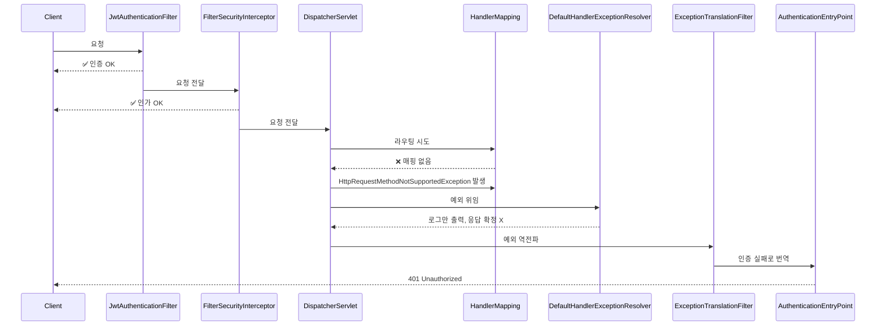
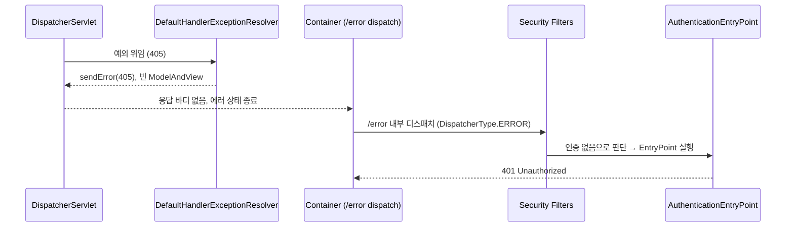

# 🛠️ 트러블슈팅 #3 – 404/405 오류가 401로 왜곡되는 문제

---

## ⚡ 문제

- 존재하지 않는 엔드포인트 또는 지원하지 않는 HTTP 메서드 요청 시
    - **기대**: 404 Not Found / 405 Method Not Allowed
    - **실제**: 401 Unauthorized 반환
- 프론트는 이를 “로그인 필요”로 오인 → UX 혼선 발생
- 서버 로그: `HttpRequestMethodNotSupportedException` 발생 후, 다시 JWT 검증이 실행되며 최종 401 응답

---

## 🔍 원인 분석

### 1. 요청 흐름



---

### 2. DispatcherServlet 단계

- **HandlerMapping**에서 매핑 실패 시 예외 발생
    - 없는 경로 → `NoHandlerFoundException`
    - 메서드 불일치 → `HttpRequestMethodNotSupportedException`
- 전역 예외 핸들러(`@RestControllerAdvice`)가 없으면,
    
    → `DefaultHandlerExceptionResolver`가 처리 시도
    

---

### 3. DefaultHandlerExceptionResolver 동작

```java
protected ModelAndView handleHttpRequestMethodNotSupported(
        HttpRequestMethodNotSupportedException ex,
        HttpServletRequest request,
        HttpServletResponse response,
        Object handler) throws IOException {

    String[] supportedMethods = ex.getSupportedMethods();
    if (supportedMethods != null) {
        response.setHeader("Allow", StringUtils.arrayToDelimitedString(supportedMethods, ", "));
    }

    response.sendError(HttpServletResponse.SC_METHOD_NOT_ALLOWED, ex.getMessage());

    return new ModelAndView(); // 비어 있는 View 반환 → DispatcherServlet이 아무것도 렌더링하지 않음
}
```

- `sendError(405)` 호출 & **빈 ModelAndView 반환** → DispatcherServlet이 렌더링할 대상 없음
- 즉, **상태코드만 설정**되고 응답이 확정되지 않음

---

### 4. 에러 디스패치 & 보안 필터 개입

- 컨테이너(톰캣 등)는 `sendError(405)`를 감지 → `/error` 로 **내부 디스패치** 수행
    - 이 요청은 **새 요청**으로 취급 (`DispatcherType.ERROR`)
    - 내부 디스패치 특성상 **Authorization 헤더 없음**
    - JWT 기반 **stateless** 환경에서는 이전 `SecurityContext`도 없음 → **익명 상태**
- 결과:
    - `FilterSecurityInterceptor`에서 **미인증 접근**으로 판단
    - `ExceptionTranslationFilter`가 가로채 `AuthenticationEntryPoint` 실행 → **401 Unauthorized**

---

### 5. 요약 다이어그램



📌 정리

**“예외 미확정 → 보안 필터로 역전파 → Security가 인증 실패로 번역(401) → 에러 디스패치 재요청에서 다시 보안 필터 개입”**

이 연쇄 때문에 404/405가 401로 왜곡됨.

---

## 🛠️ 해결책

### 1. MVC 예외를 컨트롤러 계층에서 확정

- `@RestControllerAdvice`에서 404/405 예외를 **상태코드 + 공통 바디(ApiResponse)** 로 확정
- 보안 필터로 예외 전파 차단

```java
@ExceptionHandler(HttpRequestMethodNotSupportedException.class)
protected ResponseEntity<ApiResponse<Void>> handleMethodNotSupported(HttpRequestMethodNotSupportedException e) {
    return ResponseEntity.status(HttpStatus.METHOD_NOT_ALLOWED)
                         .body(ApiResponse.fail(ErrorCode.METHOD_NOT_ALLOWED));
}

@ExceptionHandler(NoHandlerFoundException.class)
protected ResponseEntity<ApiResponse<Void>> handleNotFound(NoHandlerFoundException e) {
    return ResponseEntity.status(HttpStatus.NOT_FOUND)
                         .body(ApiResponse.fail(ErrorCode.NOT_FOUND));
}

@ExceptionHandler(Exception.class)
protected ResponseEntity<ApiResponse<Void>> handleUnhandledException(Exception e) {
	log.error("[INTERNAL_SERVER_ERROR] 예기치 못한 서버 오류", e);
	ErrorCode errorCode = ErrorCode.INTERNAL_SERVER_ERROR;
	return ResponseEntity
		.status(errorCode.getHttpStatus())
		.body(ApiResponse.fail(errorCode));
}
```

---

### 2. 에러 디스패치 경로에서 보안 필터 제외

- `JwtAuthenticationFilter`에서 `DispatcherType.ERROR` 요청은 **즉시 통과**
- `/error` 재요청에서 JWT 검증이 재실행되지 않도록 차단

---

## ✅ 결과

| 상황 | 개선 전 | 개선 후 |
| --- | --- | --- |
| 존재하지 않는 엔드포인트 | 401 Unauthorized | 404 Not Found |
| 지원하지 않는 메서드 | 401 Unauthorized | 405 Method Not Allowed |
| 인증 실패 | 401 Unauthorized | 동일 |
| 권한 부족 | 403 Forbidden | 동일 |
| 서버 오류 | 401/불명확 | 500 Internal Server Error |
- 상태 코드 **정상 분리**
- 모든 에러가 **공통 응답 포맷(ApiResponse)** 으로 반환
- `/error` 재요청에서도 JWT 필터 개입 없음 → 왜곡 방지
- 프론트는 **401(로그인 필요)** vs **404/405(경로/메서드 오류)** 를 안정적으로 구분

---

## 💡 회고

이번 문제를 해결하면서 단순히 예외처리 방식 하나를 추가하는 것 이상의 경험을 얻었다.

- **예외는 반드시 발생한 계층에서 확정해야 한다는 원칙**을 몸소 체감했다.
  그동안은 `@ControllerAdvice`나 `ExceptionHandler`를 그냥 “에러 메시지를 예쁘게 보여주는 도구” 정도로 생각했는데,
  이번 경험을 통해 *예외를 확정하지 않으면 전혀 다른 계층(보안 필터)에서 잘못 해석될 수 있다*는 사실을 알게 되었다.
    
- **Servlet 컨테이너의 에러 디스패치 흐름까지 이해하게 되었다.**
  단순히 Spring MVC와 Security만 보면 된다고 생각했는데,
  실제로는 Tomcat 같은 컨테이너가 `/error`로 내부 디스패치를 하면서 인증 컨텍스트가 사라지고,
  그 결과 Security 필터가 재개입하는 구조를 처음 명확히 이해할 수 있었다.
    
- **보안 필터와 MVC의 책임 경계**를 다시 생각하게 되었다.
  “인증/인가 문제는 Security가, 라우팅/메서드 문제는 MVC가 처리한다”는 단순한 말이
  코드 흐름을 따라가며 검증해보니 얼마나 중요한 개념인지 실감할 수 있었다.
